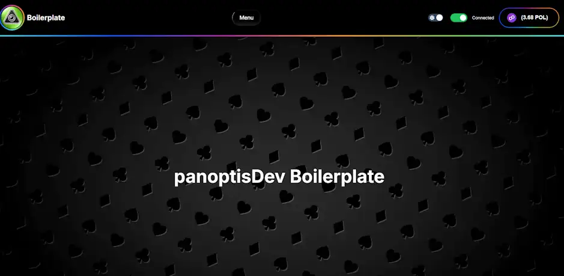

# A Boilerplate dApp by panoptisDev


### description
you got a nice navbar with custom connect button and a footer. wallet connection with viem wagmi Rainbowkit. 
* components by radix ui

## Getting Started

First, run the development server:

```bash
nvm use 20.16.0
yarn
yarn dev
```

Open [http://localhost:3000](http://localhost:3000) with your browser to see the result.

You can start editing the page by modifying `app/page.tsx`. The page auto-updates as you edit the file.
